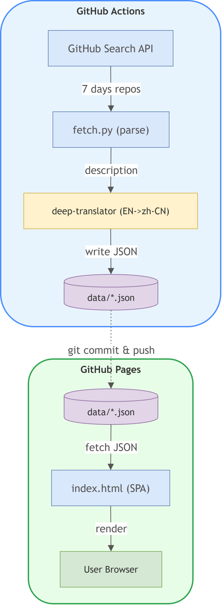

# 📰 开源日报

> 每日自动抓取 GitHub 上最新创建的 10 个开源项目，翻译为中文展示。

## ✨ 特性

- 🤖 **全自动运行** — GitHub Actions 每天 UTC 0:00 自动执行，无需人工干预
- 🌏 **中英双语** — 项目描述自动翻译为中文，原文保留对照
- 🌗 **深色 / 浅色主题** — 跟随系统偏好，也可手动切换
- 📱 **响应式布局** — 桌面、平板、手机均完美适配

## 🚀 快速开始

1. **📦 Fork 本仓库** — 点击页面右上角的 Fork 按钮
2. **⚙️ 启用 GitHub Pages** — Settings → Pages → Source 选择 `Deploy from a branch` → `main` → `/ (root)` → Save
3. **🔑 允许 Actions 写入** — Settings → Actions → General → Workflow permissions 选择 `Read and write permissions` → Save
4. **⏳ 等待自动运行** — 第二天 08:00（北京时间）自动抓取；也可手动前往 Actions 运行 "Daily Update"
5. **🌐 访问站点** — `https://\<你的用户名\>.github.io/daily-github`

💡 如果 Settings 中找不到 Pages？

先在仓库创建任意文件（如修改本 README）并提交推送，GitHub 会自动激活 Pages 功能。

## 🛠️ 技术栈

| 分层 | 技术 | 说明 |
|------|------|------|
| 前端 | 纯 HTML / CSS / JS | 零依赖，GitHub Pages 原生托管 |
| 后端 | Python 3 + deep-translator | 调用 GitHub API 抓取并翻译为中文 |
| 自动化 | GitHub Actions | cron 每天 UTC 0:00 自动运行并提交数据 |

## ⚙️ 工作原理

## 📄 License

MIT License — 详见 [LICENSE](LICENSE) 文件。

## 🙏 致谢

- [GitHub REST API](https://docs.github.com/en/rest) — 项目数据来源
- [googletrans](https://pypi.org/project/googletrans/) — 免费接口翻译
- [GitHub Pages](https://pages.github.com/) — 免费静态托管
